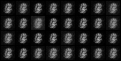

### Generative Adversarial Networks (GANs): 2014 by Ian Goodfellow

---

The goal of GANs is to simultaneously train two neural networks using an antagonistic theory, where both networks engage in a game-theoretic scenario. One network is the Generator $(G)$, which captures the data distribution, and the other is the Discriminator $(D)$, tasked with distinguishing between real dataset samples and those generated by $G$. 

The objective is to minimize the error of the Generator $G$ and maximize the error of the Discriminator $D$.

In other words, $D$ and $G$ engage in a two-player minimax game with the value function V(G,D):

$$
\min_{G} \max_{D} V(D, G) = \mathbb{E}_{\boldsymbol{x} \sim p_{\text{data}}(\boldsymbol{x})} [\log D(\boldsymbol{x})] + \mathbb{E}_{\boldsymbol{z} \sim p_{\boldsymbol{z}}(\boldsymbol{z})} [\log(1 - D(G(\boldsymbol{z})))],
$$

#### Theoretical Insights:

**Theorem 1**: The training criterion of a GAN reaches its global minimum when the distribution generated by the model exactly matches the data distribution. At this point, the training criterion achieves a specific value, and any deviation from this optimal distribution increases the training criterion.

**Proposition 2**: Describes the conditions under which the training algorithm of a GAN (where the discriminator is optimized at each step) ensures that the generated distribution will converge to the data distribution. In practice, this means that if the model has sufficient capacity (i.e., it is complex enough), successive updates will gradually improve the generated distribution until it matches the data distribution.

#### Framework Advantages and Disadvantages:

**Disadvantages**:
- Lack of explicit representation of $( p_g(x))$.
- Need for precise synchronization between D (discriminator) and G (generator) during training.
- Risk of "Helvetica scenario" where G collapses too many values of z to the same x, limiting the diversity needed to model $( p_{data} $).

**Advantages**:
- No Markov chains required.
- Exclusive use of backpropagation for gradient computation.
- No inference during training.
- Ability to integrate a wide variety of functions into the model.
  
**Key Concepts**:
- **Generative Adversarial Networks (GANs)**: A machine learning framework where two neural networks, the Generator $(G)$ and the Discriminator $(D)$, compete. G tries to generate realistic data, while D tries to distinguish real data from generated data.
- $( p_g(x))$: The probability distribution of data generated by the generator.
- $( p_{data}(x))$: The probability distribution of real data.
- **Helvetica scenario**: A problem where the generator produces highly similar samples, lacking diversity.
- **Markov Chains**: A mathematical model describing a sequence of events where the probability of each event depends only on the previous state.
- **Backpropagation (backprop)**: A key algorithm for training neural networks, which calculates how to adjust network weights to minimize error.
- **Inference**: The process of using a trained model to make predictions on new data.
- **Degenerate Distributions**: Probability distributions where probability is concentrated on a small number of values, even a single value.

#### Result of the Generator:
We use the MNIST dataset and these are the result of the generator we saw that at the 200 epochs images are very similar to the real images.

**Epoch1**:

</img>

**Epoch200**:

</img>

---
