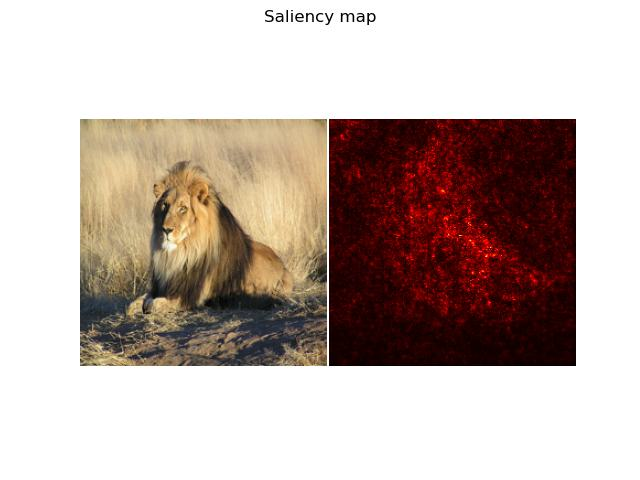
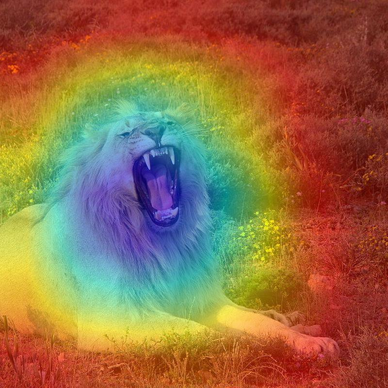

# Interpreting Neural Networks with Saliency and Grad-CAM

In the context of neural networks applied to image or video data, interpretability is crucial to understand how a model makes decisions. Two popular methods for visualizing and interpreting these models are **Saliency Maps** and **Grad-CAM (Gradient-weighted Class Activation Mapping)**. Below is a detailed explanation of both methods along with mathematical formulations.

## Saliency Maps

**Saliency Maps** highlight the regions of an image that have the most influence on the model's prediction. They are computed by taking the gradient of the class score with respect to the input image. This provides insight into which pixels of the image are most important for the model's decision.

### Mathematical Formula

Given an image $\mathbf{I}$ and a class score $y^c$ for class $c$:

1. **Compute Gradients**: Calculate the gradient of the class score with respect to the input image:

   $$S_{ij} = \frac{\partial y^c}{\partial I_{ij}}$$

   where $S_{ij}$ represents the saliency at pixel location $(i, j)$.

2. **Absolute Value**: Often, the absolute value of the gradient is used to create the saliency map:

   $$\text{Saliency}_{ij} = \left| \frac{\partial y^c}{\partial I_{ij}} \right|$$

3. **Normalization**: Normalize the saliency map to the range [0, 1] for visualization:

   $$\text{Saliency}_{ij} = \frac{\text{Saliency}_{ij} - \text{min}(\text{Saliency})}{\text{max}(\text{Saliency}) - \text{min}(\text{Saliency})}$$

## Grad-CAM (Gradient-weighted Class Activation Mapping)

**Grad-CAM** is a technique used to produce class-specific heatmaps that highlight the regions of the image contributing most to the class score. It uses the gradients of the class score flowing into the last convolutional layer to create these heatmaps.

### Mathematical Formula

1. **Gradients**: Compute the gradients of the class score $y^c$ with respect to the activations of the last convolutional layer:

   $$\frac{\partial y^c}{\partial A^k}$$

   where $A^k$ denotes the activation of the $k$ -th feature map.

2. **Weights**: Calculate the weights $\alpha^k$ for each feature map $A^k$ by averaging the gradients over spatial dimensions:

   $$\alpha^k = \frac{1}{Z} \sum_{i,j} \frac{\partial y^c}{\partial A^k_{ij}}$$

   where $Z$ is the number of spatial locations in the feature map.

3. **Weighted Combination**: Compute the weighted sum of the feature maps:

   $$L^c_{Grad-CAM} = \text{ReLU} \left( \sum_k \alpha^k A^k \right)$$

4. **Normalization**: Normalize the resulting heatmap to the range [0, 1] and resize it to match the dimensions of the input image:

   $$\text{Grad-CAM}_{ij} = \frac{\text{Grad-CAM}_{ij} - \text{min}(\text{Grad-CAM})}{\text{max}(\text{Grad-CAM}) - \text{min}(\text{Grad-CAM})}$$

   where $\text{Grad-CAM}_{ij}$ represents the value at pixel location $(i, j)$ in the heatmap.

## Visualization

In the example below, we apply Grad-CAM to visualize the regions of an image that are most relevant for the model's prediction.

### Example Output

The above image demonstrates how Grad-CAM highlights the important regions in the image used by the ResNet-18 model to make its prediction.

---
